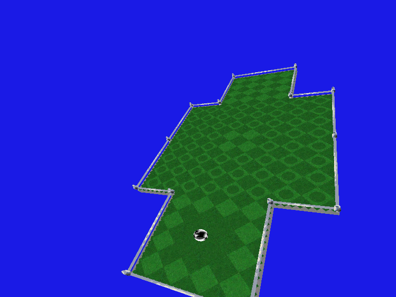

# Prototype

Currently this project only implements basic parts of the game: minimal GUI,
basic physics, and a basic renderer.  Much of the game is currently
unimplemented (audio, goals, complete moving body physics, gameplay mechanics,
etc.), but this project still serves as a useful example of a purely functional
FRP application.  Currently the physics has a few bugs.

# Immutaball

Immutaball is a rewrite of Neverball in Haskell.  It is useful for gaming and
studying a purely functional FRP application.  It does not use IO except for
interfacing with external dependencies and ‘base’/‘haskell2010’ IO primitives
like writing to a file (including concurrent evaluation).

# Screenshots and demo



Demo video: <https://byronjohnson.net/immutaball/immutaball-v0.1.0.1-demo.html>.
(Demo recorded before BSP physics algorithm.)

## Usage example

```
(cd -- "${HOME}/git" && git clone https://github.com/Neverball/neverball)  # clone neverball
(cd -- "${HOME}/git/neverball" && make -j7)      # build neverball
cabal run immutaball -- -d ~/git/neverball/data  # run immutaball
```
